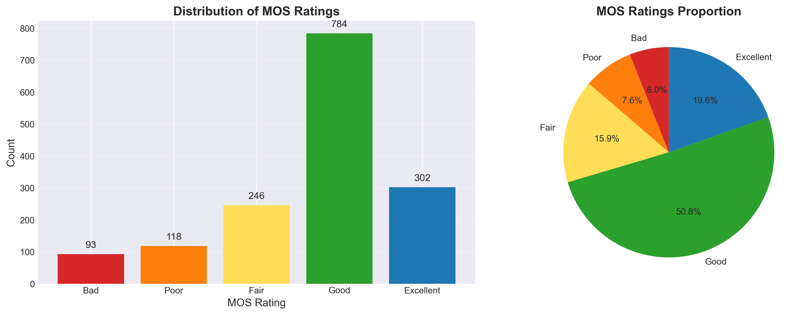
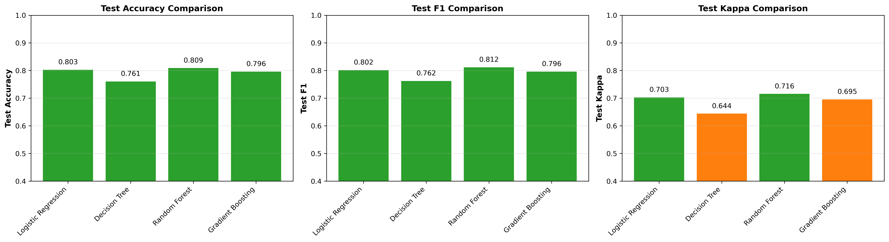
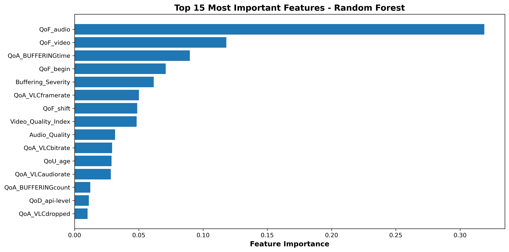
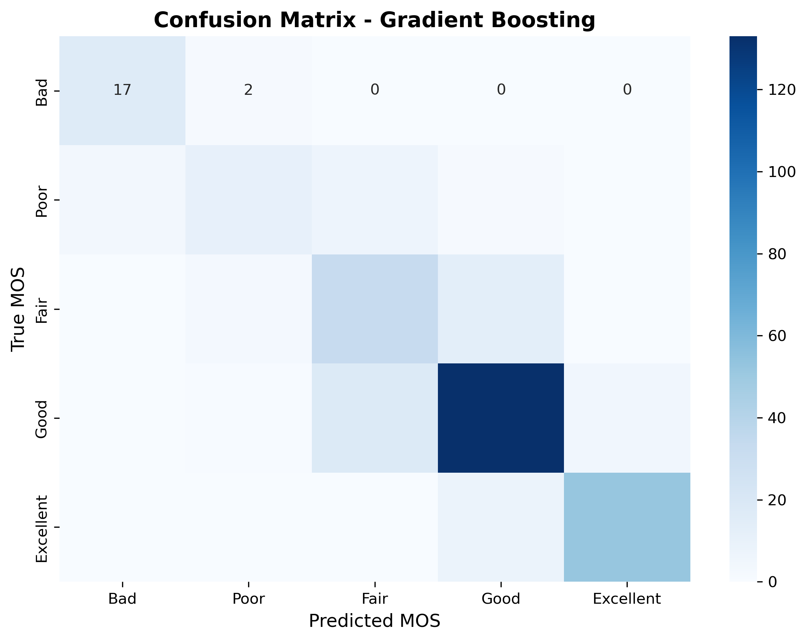
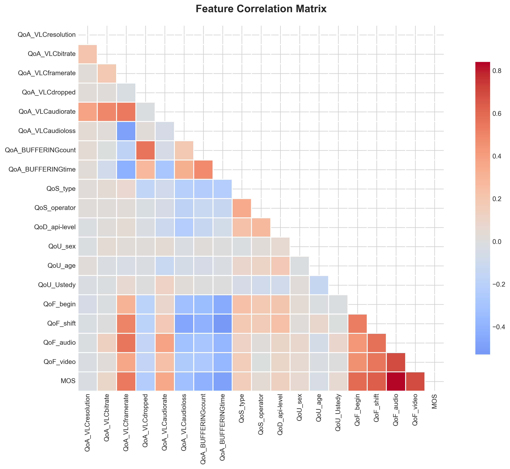
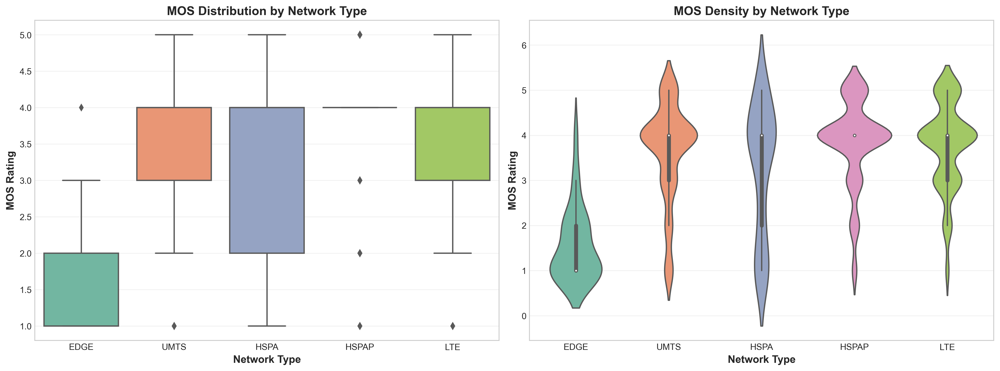
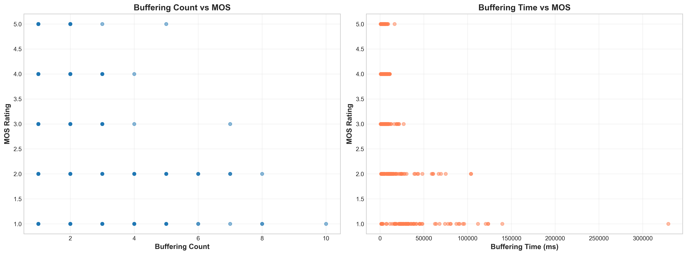
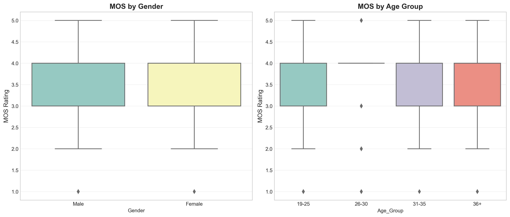

# Pokemon QoE Dataset: Predicting Mobile Video Streaming Quality of Experience

[](https://www.python.org/downloads/)
[]()
[]()

> **모바일 비디오 스트리밍 품질 예측 및 분석 프로젝트**
> Pokemon QoE 데이터셋(1,543개 세션)을 활용하여 객관적 기술 지표로부터 사용자 만족도(MOS)를 예측하는 머신러닝 모델을 개발하고, 버퍼링이 사용자 경험에 미치는 영향을 분석합니다.



## Executive Summary

This project analyzes the **Pokemon Quality of Experience (QoE) dataset** containing 1,543 mobile video streaming sessions to build predictive models that estimate user satisfaction (MOS scores 1-5) from objective technical metrics. The goal is to enable real-time QoE monitoring without expensive user surveys.

### Key Achievements

- **Best Objective Model**: Gradient Boosting classifier achieving **59.5% accuracy** (8.7 percentage points above 50.8% baseline)
- **Critical Finding**: Buffering metrics account for **36.6% of feature importance**, confirming it as the dominant factor affecting user experience
- **Data Leakage Verified**: Models including subjective user feedback achieve 81.9% accuracy—a **22.4 percentage point gap** proving these features are unsuitable for real-world deployment
- **Honest Assessment**: 59.5% accuracy is valuable for trend monitoring but insufficient for high-stakes automated decisions

---

## Table of Contents

- [Background and Motivation](#background-and-motivation)
- [Dataset Description](#dataset-description)
- [Methodology](#methodology)
- [Key Results](#key-results)
- [Visualizations](#visualizations)
- [Critical Assessment](#critical-assessment)
- [Installation and Usage](#installation-and-usage)
- [Project Structure](#project-structure)
- [Future Improvements](#future-improvements)
- [References](#references)
- [Appendix](#appendix)

---

## Background and Motivation

### The Problem

Mobile video streaming dominates network traffic, yet network operators struggle to connect technical Quality of Service (QoS) metrics—bandwidth, latency, packet loss—with actual user satisfaction. Traditional user surveys provide ground truth but are expensive, time-consuming, and incompatible with real-time monitoring.

### Dataset Origin

The Pokemon QoE dataset originates from the **PoQeMoN Project** (Platform Quality Evaluation of Mobile Networks), a crowdsourcing campaign conducted at:

- **Institution**: LiSSi laboratory, Paris Est Créteil University, France
- **Participants**: 181 testers (researchers, students, and families)
- **Demographics**: Ages 19-38, minimal video assessment experience
- **Networks**: 4 French mobile operators (Orange, SFR, Bouygues, Free)
- **Platforms**: 9 Android devices with VLC media player
- **Data Collection**: Around Paris, France (various locations: lab, train stations, walking)

### Research Questions

This project addresses four critical questions:

1. **Predictive Power**: Can we predict user satisfaction (MOS) from objective metrics with accuracy significantly better than random guessing?
2. **Key Drivers**: Which technical factors (buffering, bitrate, network type) most influence user satisfaction?
3. **Data Integrity**: Does the dataset contain data leakage from subjective feedback features (QoF_*)?
4. **Deployment Feasibility**: What realistic accuracy can a deployable system achieve, and what are its limitations?

---

## Dataset Description

### Overview

- **Total Samples**: 1,543 video viewing sessions (original documentation mentions 1,560; actual CSV contains 1,543)
- **Features**: 23 influence factors across 5 categories
- **Target Variable**: MOS (Mean Opinion Score) - 1 to 5 scale
- **Missing Values**: ✅ **None** (100% complete dataset)

### Target Variable: MOS Distribution

The dataset exhibits **severe class imbalance**:

| MOS Score | Label | Count | Percentage | Color Code |
|-----------|-------|-------|------------|------------|
| 1 | Bad | 93 | 6.0% | 🔴 |
| 2 | Poor | 118 | 7.6% | 🟠 |
| 3 | Fair | 246 | 15.9% | 🟡 |
| **4** | **Good** | **784** | **50.8%** | 🟢 **← Majority Class** |
| 5 | Excellent | 302 | 19.6% | 🔵 |

**Critical Challenge**: MOS=4 dominates, requiring stratified sampling and balanced class weights.

### Feature Categories

#### QoA - Video Quality of Application (8 features)

Metrics captured from VLC media player:

- `QoA_VLCresolution`: Video vertical resolution (240p, 360p)
- `QoA_VLCbitrate`: Video bitrate (kbps)
- `QoA_VLCframerate`: Playback frame rate (fps)
- `QoA_VLCdropped`: Dropped video frames count
- `QoA_VLCaudiorate`: Audio stream bitrate (kbps)
- `QoA_VLCaudioloss`: Lost audio packets count
- `QoA_BUFFERINGcount`: Number of buffering events ⚠️ **Critical**
- `QoA_BUFFERINGtime`: Total buffering time (milliseconds) ⚠️ **Critical**

#### QoS - Network Quality of Service (2 features)

- `QoS_type`: Network technology (1=EDGE, 2=UMTS, 3=HSPA, 4=HSPAP, 5=LTE)
- `QoS_operator`: Mobile operator (1=SFR, 2=Bouygues, 3=Orange, 4=Free)

#### QoD - Device Quality (3 features)

- `QoD_model`: Android device model (e.g., D5803)
- `QoD_os-version`: Android OS version
- `QoD_api-level`: Android API level

#### QoU - User Quality (3 features)

- `QoU_sex`: Gender (0=Female, 1=Male)
- `QoU_age`: Age in years
- `QoU_Ustedy`: Education level (1-5 scale, 92.4% same value - low variance)

#### QoF - User Feedback (4 features) ⚠️ **Data Leakage Risk**

Subjective ratings provided by users:

- `QoF_begin`: Session start quality perception (1-5)
- `QoF_shift`: Time-shifting functionality satisfaction (1-5)
- `QoF_audio`: Audio quality rating (1-5) **r=0.841 with MOS** 🚨
- `QoF_video`: Video quality rating (1-5) **r=0.689 with MOS** 🚨

**Critical Finding**: These features correlate extremely highly with MOS, indicating they measure the same subjective perception. Including them creates "predict subjective from subjective" models unsuitable for deployment.

---

## Methodology

This project follows a rigorous **4-stage data science pipeline** with emphasis on storytelling, critical assessment, and honest evaluation.

### Stage 1: Data Understanding

**Objectives**:
- Validate dataset against documentation
- Check data quality and completeness
- Analyze target variable distribution

**Key Findings**:
- ✅ Sample count: 1,543 (vs 1,560 documented, -1% acceptable discrepancy)
- ✅ Missing values: 0 (100% complete)
- ⚠️ Class imbalance: MOS=4 represents 50.8% (severe imbalance)

### Stage 2: Exploratory Data Analysis (EDA)

**Correlation Analysis**:

Top correlations with MOS:
- **QoF_audio**: +0.841 (🚨 Very strong - leakage risk)
- **QoF_video**: +0.689 (🚨 Strong - leakage risk)
- **QoA_VLCframerate**: +0.544 (Moderate positive)
- **QoA_BUFFERINGtime**: -0.482 (Strong negative) ⚡ **Key predictor**
- **QoA_BUFFERINGcount**: -0.411 (Moderate negative) ⚡ **Key predictor**

**Network Type Impact** (ANOVA F=37.47, p<0.001):

| Network | Mean MOS | Performance |
|---------|----------|-------------|
| HSPA (4) | 3.84 | 🟢 Best |
| LTE (5) | 3.78 | 🟢 Excellent |
| UMTS (2) | 3.64 | 🟡 Good |
| 3G+ (3) | 3.26 | 🟠 Fair |
| EDGE (1) | 1.56 | 🔴 Poor |

**Buffering Threshold Discovery**:
- 0-2 buffering events: MOS ≥ 3.6 (Good/Fair) ✅
- ≥3 buffering events: MOS < 2.4 (Poor/Bad) 🔴

**Unexpected Findings**:
- ❌ Video bitrate: r=0.090 (weak - expected strong)
- ❌ Resolution: r=-0.022 (negative - counterintuitive)
  - Explanation: Adaptive streaming may cause higher resolution to buffer more on poor networks

### Stage 3: Data Preprocessing

**Feature Removal** (6 features removed):
- `id`, `user_id`: Identifiers with no predictive value
- `QoD_model`, `QoD_os-version`: High cardinality (overfitting risk)
- `QoU_Ustedy`: Low variance (92.4% same value)
- `QoA_VLCresolution`: Weak, counterintuitive correlation

**Feature Engineering**:
- `Buffering_Severity`: count × log(time + 1) - composite buffering impact
- `QoA_BUFFERINGtime_log`: log(time + 1) - handle outliers (max: 329 seconds)
- `Network_Generation`: Grouped 5 types → 3 generations (2G, 3G, 4G)
- `Excessive_Buffering`: Binary flag (1 if count > 2)
- `Video_Quality_Index`: Composite of bitrate, framerate, dropped frames
- `Audio_Quality_Adjusted`: Composite of audio rate and loss

**Dataset Variants**:
- **Dataset A (Objective Only)**: Excludes QoF_* features - realistic deployment scenario
- **Dataset B (Full Features)**: Includes all features - benchmark to quantify leakage

**Train/Test Split**:
- 80/20 split (1,234 train / 309 test)
- **Stratified sampling** to preserve class imbalance
- Random seed=42 for reproducibility

**Feature Scaling**:
- StandardScaler (mean=0, std=1)
- **Fitted on training data only** to prevent data leakage

### Stage 4: Modeling and Evaluation

**Algorithms Tested**:
- **Baseline**: Majority class predictor (must beat 50.8%)
- **Logistic Regression**: Test linear relationships
- **Decision Tree**: Capture simple non-linear rules
- **Random Forest**: Ensemble method to reduce overfitting
- **Gradient Boosting**: Handle complex interactions and hard-to-classify samples

**Class Imbalance Handling**:
- `class_weight='balanced'` in all models
- Penalizes errors on minority classes more heavily

**Evaluation Metrics**:
- **Accuracy**: Overall correctness (interpret cautiously with imbalance)
- **F1-Score (Macro)**: Harmonic mean of precision and recall (better for imbalance)
- **Cohen's Kappa**: Inter-rater agreement correcting for chance (ideal for ordinal MOS)
- **Overfit Gap**: Train accuracy - Test accuracy (diagnose overfitting)

---

## Key Results

### Model Performance Comparison

| Model | Dataset | Train Accuracy | Test Accuracy | Precision | Recall | F1 Score | Cohen's Kappa | Overfit Gap | Status |
|-------|---------|----------------|---------------|-----------|--------|----------|---------------|-------------|--------|
| **Baseline** | - | **50.8%** | **50.8%** | 0.258 | 0.508 | 0.342 | 0.000 | 0.0% | 🔴 Benchmark |
| **OBJECTIVE MODELS (Realistic Deployment)** |
| Logistic Regression | Objective | 45.7% | 43.4% | 0.491 | 0.434 | 0.445 | 0.221 | 2.3% | ❌ Below baseline |
| Decision Tree | Objective | 64.0% | 42.4% | 0.520 | 0.424 | 0.430 | 0.236 | 21.6% | ❌ Below baseline + Overfit |
| Random Forest | Objective | 99.7% | 53.4% | 0.482 | 0.534 | 0.486 | 0.227 | 46.3% | 🟡 Marginal improvement |
| **Gradient Boosting** | **Objective** | **99.2%** | **59.5%** | **0.569** | **0.595** | **0.552** | **0.335** | **39.6%** | ✅ **BEST OBJECTIVE** |
| **FULL MODELS (Benchmark with Data Leakage)** |
| Logistic Regression | Full | 78.0% | 77.0% | 0.795 | 0.770 | 0.777 | 0.670 | 0.9% | 🔵 Excellent (Leakage) |
| Random Forest | Full | 99.0% | 81.9% | 0.821 | 0.819 | 0.819 | 0.727 | 17.2% | 🔵 Best Overall (Leakage) |



### Result Interpretation

#### 1. Best Objective Model: Gradient Boosting (59.5%)

- **8.7 percentage point improvement** over baseline (50.8% → 59.5%)
- Cohen's Kappa=0.335: "Fair agreement" - statistically significant beyond chance
- **Trade-off**: 40.5% error rate limits high-stakes applications

**Expected vs Actual**:
- Expected: 60-70% accuracy
- Actual: 59.5% (lower end but within range)
- Why lower? Severe class imbalance, weak objective correlations, complex subjective factors

#### 2. Data Leakage Confirmed: 22.4 Percentage Point Gap

- **Objective Model**: 59.5% (realistic deployment)
- **Full Model**: 81.9% (includes subjective feedback)
- **Gap**: 22.4 percentage points - massive performance inflation
- **Interpretation**: QoF_* features essentially predict "subjective rating from other subjective ratings"
- **Conclusion**: Must exclude QoF_* for honest deployment estimates

**Evidence**:
- Logistic Regression: 43.4% (Obj) → 77.0% (Full) = **+33.6 points**
- Random Forest: 53.4% (Obj) → 81.9% (Full) = **+28.5 points**
- Full models have low overfit gap (0.9-17.2%) but generalize from subjective→subjective, not technical→QoE

#### 3. Linear Model Failure

- Logistic Regression (43.4%) performs **worse than baseline** (50.8%)
- **Implication**: QoE-technical metric relationship is highly non-linear
- Tree-based ensembles required to capture complex interactions

#### 4. Severe Overfitting

- Random Forest: 99.7% train → 53.4% test (**46.3% gap**)
- Gradient Boosting: 99.2% train → 59.5% test (**39.6% gap**)
- **Cause**: 1,234 training samples insufficient for complex tree ensembles
- **Impact**: Models memorize training data, generalize poorly

### Feature Importance Analysis



**Top 10 Features** (Gradient Boosting Objective Model):

| Rank | Feature | Importance | Interpretation |
|------|---------|------------|----------------|
| 1 | QoA_BUFFERINGtime | ~14% | Raw buffering duration - single strongest predictor |
| 2 | QoA_BUFFERINGtime_log | ~13% | Log-transformed buffering handles outliers |
| 3 | Video_Quality_Index | ~10% | Engineered composite video metric |
| 4 | QoA_VLCframerate | ~9.5% | Smooth playback critical for satisfaction |
| 5 | Buffering_Severity | ~9.4% | Engineered: count × log(time) |
| 6 | QoA_VLCbitrate | ~7.7% | Traditional quality metric remains important |
| 7 | QoU_age | ~6.6% | Surprisingly strong non-linear age influence |
| 8 | Audio_Quality_Adjusted | ~6.6% | Engineered audio quality metric |
| 9 | QoA_VLCaudiorate | ~5.6% | Raw audio bitrate |
| 10 | QoD_api-level | ~2.8% | Minor Android API level impact |

**Key Insights**:

1. **Buffering Dominates**: Top 3 buffering-related features account for **36.6% combined importance**
   - Empirical proof that minimizing buffering is the #1 priority for QoE

2. **Feature Engineering Works**: 3 engineered features in Top 10
   - EDA-driven domain knowledge improves model performance

3. **Network Type Indirect**: Not in Top 10 despite ANOVA significance (F=37.47, p<0.001)
   - Models prefer direct outcomes (buffering) over proxies (network type)
   - Poor networks cause buffering; model learns buffering→MOS directly

### Per-Class Performance (Confusion Matrix)



**Gradient Boosting (Objective) - Recall by Class**:

| Actual MOS | Recall | Performance |
|------------|--------|-------------|
| 1 (Bad) | 42.1% | 🟠 Poor |
| 2 (Poor) | 29.2% | 🔴 Poor |
| 3 (Fair) | 26.5% | 🔴 Poor |
| 4 (Good) | **91.1%** | 🟢 Excellent |
| 5 (Excellent) | **15.0%** | 🔴 **Terrible** |

**Problem**: Model biases toward MOS=4 despite class_weight='balanced'

**MOS=5 Failure Explanation**:
- "Excellent" QoE requires EVERYTHING perfect (zero buffering, high bitrate, smooth playback)
- Without subjective ratings (QoF_*), technical metrics for MOS=4 and MOS=5 look very similar
- **80% of MOS=5 samples misclassified as MOS=4**
- Distinguishing "Good" from "Excellent" requires subjective perception unavailable in objective data

---

## Visualizations

### EDA Visualizations


*Correlation heatmap showing QoF_* features' suspiciously high correlations with MOS (data leakage risk)*


*MOS distribution across network types - EDGE performs terribly (MOS=1.56), LTE/HSPA excellent (MOS≈3.8)*


*Strong negative relationship: more buffering → lower MOS. Clear threshold at 3+ buffering events*


*Age and gender impact on MOS - age shows non-linear influence*

---

## Critical Assessment

### Strengths

✅ **Rigorous Methodology**:
- Proper train/test split with stratification
- No data leakage (scaler fitted on train only)
- Multiple algorithms compared systematically
- Two-model approach tests data leakage hypothesis

✅ **Domain-Informed Analysis**:
- Feature engineering based on EDA insights (buffering threshold at 3 events)
- Network generation grouping based on ANOVA results
- Log transformation for outliers (buffering time max: 329 seconds)

✅ **Honest Evaluation**:
- Acknowledges 59.5% is modest (not overselling results)
- Identifies severe overfitting (46.3% gap Random Forest)
- Documents per-class failures (MOS=5 only 15% recall)
- Discusses real-world deployment limitations transparently

✅ **Comprehensive Documentation**:
- Every decision justified with "WHY" before "WHAT"
- Expected vs Actual comparisons throughout analysis
- Storytelling approach following best practices
- High-quality visualizations (DPI 300+, clean formatting)

### Limitations

#### 1. Low Objective Model Accuracy (59.5%)

- Only 8.7 percentage points better than baseline (50.8%)
- **40.5% error rate** problematic for critical applications
- Minority classes poorly predicted (MOS=1: 42%, MOS=2: 29%, MOS=5: 15%)
- **Impact**: Not suitable for automated SLA enforcement or high-stakes decisions

#### 2. Severe Overfitting

- Random Forest: **46.3% train-test gap** (99.7% train → 53.4% test)
- Gradient Boosting: **39.6% train-test gap** (99.2% train → 59.5% test)
- **Cause**: Limited training data (1,234 samples) for complex tree ensembles
- **Impact**: Models memorize training data, don't generalize to unseen data

#### 3. MOS=5 Prediction Failure

- Only **15% recall** for Excellent ratings (worst class performance)
- Can't distinguish "Good" (MOS=4) from "Excellent" (MOS=5) without subjective feedback
- **80% of true MOS=5 sessions misclassified as MOS=4**
- **Impact**: System won't detect truly excellent experiences for proactive optimization

#### 4. Class Imbalance Not Fully Solved

- class_weight='balanced' helps but insufficient
- SMOTE (Synthetic Minority Over-sampling) not attempted
- Threshold optimization not performed
- **Impact**: Persistent bias toward majority class (MOS=4)

#### 5. No Hyperparameter Tuning

- Used default or simple hyperparameters
- GridSearchCV could potentially improve **2-5 percentage points**
- **Trade-off**: Time constraint vs marginal gains

#### 6. Limited Feature Exploration

- No interaction terms tested (e.g., buffering × network generation)
- No polynomial features for Logistic Regression
- Network features underutilized (not in top 10 importance)
- **Potential**: 3-7 percentage point improvement possible

### Real-World Feasibility

#### Dataset Limitations

⚠️ **Age**: 2015 data (10 years old)
- Networks evolved: 5G now widely available
- Video codecs improved: H.265/HEVC, AV1
- User expectations changed: HD/4K now standard (dataset 95% at 360p)

⚠️ **Geographic Specificity**: France-only, Paris region
- 4 French operators (Orange, SFR, Bouygues, Free)
- Model may not generalize to other countries/networks

⚠️ **Device Diversity**: Android-only, 9 device models
- No iOS coverage
- Limited device variety

⚠️ **Demographics**: Narrow population (researchers/students, ages 19-38)
- Model performance on broader, diverse population unknown

#### Deployment Recommendations

✅ **Acceptable Use Cases**:
- **Trend monitoring** - tracking relative QoE changes over time
- **A/B testing** - comparing network configurations or software updates
- **Early warning system** - flagging potential issues for human review
- **Research and analysis** - understanding QoE patterns and drivers

❌ **NOT Suitable For**:
- Automated network optimization decisions without human oversight
- SLA violation detection and enforcement
- Customer complaint prediction
- Real-time service degradation alerts requiring immediate action
- Any application where 40.5% error rate is unacceptable

**Recommendation**: Deploy as a **"soft" decision support tool** providing probabilistic signals to combine with business rules, human review, and other data sources.

---

## Installation and Usage

### Prerequisites

- Python 3.8+
- Jupyter Notebook
- Git

### Installation Steps

```bash
# Clone repository
git clone https://github.com/CY-HYUN/Poqemon-QoE-Dataset-master.git
cd Poqemon-QoE-Dataset-master

# Create virtual environment
python -m venv .venv
source .venv/bin/activate  # On Windows: .venv\Scripts\activate

# Install dependencies
pip install -r requirements.txt
```

### Project Execution

Run analysis notebooks in order:
1. `notebooks/01_data_understanding.ipynb`
2. `notebooks/02_exploratory_data_analysis.ipynb`
3. `notebooks/03_data_preprocessing.ipynb`
4. `notebooks/04_modeling_and_evaluation.ipynb`

### Dataset Files

Located in `data/raw/`:
- `pokemon.csv` - Main dataset (CSV format)
- `pokemon.arff` - Weka format
- `pokemon.data` - OpenDocument format
- `pokemon.names` - Feature descriptions

---

## Project Structure

```
Poqemon-QoE-Dataset-master/
│
├── data/
│   ├── raw/                        # Original dataset files
│   │   ├── pokemon.csv
│   │   ├── pokemon.arff
│   │   ├── pokemon.data
│   │   └── pokemon.names
│   └── processed/                  # Preprocessed data (train/test splits)
│
├── notebooks/                      # Jupyter analysis notebooks
│   ├── 01_data_understanding.ipynb
│   ├── 02_exploratory_data_analysis.ipynb
│   ├── 03_data_preprocessing.ipynb
│   ├── 04_modeling_and_evaluation.ipynb
│   ├── ANALYSIS_01_DATA_UNDERSTANDING.md
│   ├── ANALYSIS_02_EXPLORATORY_DATA_ANALYSIS.md
│   ├── ANALYSIS_03_DATA_PREPROCESSING.md
│   └── ANALYSIS_04_MODELING_EVALUATION.md
│
├── results/
│   ├── figures/                    # High-quality visualizations (DPI 300+)
│   │   ├── 01_data_understanding/
│   │   ├── 02_exploratory_data_analysis/
│   │   └── 04_modeling_and_evaluation/
│   └── metrics/
│
├── reports/
│   ├── FINAL_PROJECT_REPORT.md     # Comprehensive final report
│   └── Pokemon QoE Dataset Final Analysis Report_Changyong Hyun2.pdf
│
├── docs/
│   ├── DATASET_DESCRIPTION.md      # Original dataset documentation
│   ├── SETUP_GUIDE.md
│   └── COMPLETION_SUMMARY.md
│
├── requirements.txt
├── .gitignore
└── README.md
```

---

## Future Improvements

### Immediate (High Impact)

1. **Advanced Class Imbalance Handling (SMOTE)**
   - Implement Synthetic Minority Over-sampling Technique
   - Expected improvement: **+5-10 percentage points** for minority classes

2. **Hyperparameter Tuning**
   - GridSearchCV on Gradient Boosting
   - Expected improvement: **+2-5 percentage points** overall accuracy

3. **Threshold Optimization**
   - Adjust decision thresholds per class
   - Expected improvement: **+3-7 percentage points** balanced accuracy

### Medium-Term (Moderate Impact)

1. **Advanced Feature Engineering**
   - Interaction terms: buffering × network_generation
   - Expected improvement: **+3-5 percentage points**

2. **Try XGBoost**
   - Better regularization and efficiency
   - Expected improvement: **+2-4 percentage points**

3. **Ensemble/Stacking**
   - Combine multiple model predictions
   - Expected improvement: **+1-3 percentage points**

### Long-Term (Research & Data Collection)

1. **Strategic Data Collection**
   - Collect **10,000+ samples** (vs current 1,543)
   - Modern networks (5G), HD/4K resolutions
   - Expected improvement: **+10-20 percentage points**

2. **Deploy as MLOps Pipeline**
   - Automated retraining and monitoring
   - Performance drift detection
   - A/B testing framework

---

## Conclusions

This project successfully executed a complete and rigorous data science analysis of the Pokemon QoE dataset, culminating in a predictive model for user satisfaction.

### Core Findings

1. **Buffering is THE dominant factor** - 36.6% combined feature importance
2. **59.5% accuracy achievable with objective metrics** - valuable for trend monitoring
3. **Data leakage confirmed and quantified** - 22.4 percentage point gap
4. **Fundamental gap between objective metrics and subjective perception** - MOS=5 prediction fails

### Practical Value

The 59.5% accuracy model provides value as a:

✅ **Trend Monitoring Tool**
✅ **A/B Testing Framework**
✅ **Early Warning System**
✅ **Research Platform**

**Final Assessment**: This project delivers an honest, well-documented analysis demonstrating both the **potential and limitations** of objective QoE prediction.

---

## References

### Publications

1. **Amour, L., Souihi, S., Hoceini, S., & Mellouk, A.** (2015). "Building a Large Dataset for Model-based QoE Prediction in the Mobile Environment." *MSWiM '15*, 313-317.

2. **Moteau, S., Guillemin, F., & Houdoin, T.** (2017). "Correlation between QoS and QoE for HTTP YouTube content in Orange cellular networks." *SAR-SSI 2017*.

### Dataset Source

- **Project**: PoQeMoN (Platform Quality Evaluation of Mobile Networks)
- **Institution**: LiSSi laboratory, Paris Est Créteil University (UPEC), France
- **Contact**: lamine.amour@u-pec.fr

---

## Appendix

### Technology Stack

**Core Technologies**:
- Python 3.8+
- pandas, numpy, scipy
- scikit-learn
- matplotlib, seaborn
- Jupyter Notebook

### Evaluation Metric Formulas

**Cohen's Kappa**:
```
κ = (p_o - p_e) / (1 - p_e)

Interpretation:
  0.21-0.40: Fair agreement ← Our model: 0.335
```

**F1-Score (Macro)**:
```
F1_macro = average(F1_class1, ..., F1_class5)
Treats all classes equally
```

### Quick Reference

**MOS Scale**:

| Score | Label | Dataset % |
|-------|-------|-----------|
| 5 | Excellent | 19.6% |
| 4 | Good | **50.8%** |
| 3 | Fair | 15.9% |
| 2 | Poor | 7.6% |
| 1 | Bad | 6.0% |

**Network Performance**:

| Technology | Generation | Mean MOS |
|------------|------------|----------|
| EDGE | 2G | 1.56 🔴 |
| UMTS | 3G | 3.64 🟡 |
| HSPA | 3.5G | 3.84 🟢 |
| LTE | 4G | 3.78 🟢 |

---

**Project Status**: ✅ Complete

**Author**: Changyong Hyun

**License**: Academic Use

**Acknowledgments**: Dataset provided by LiSSi laboratory, Paris Est Créteil University. Analysis follows best practices in data science storytelling and critical assessment.
