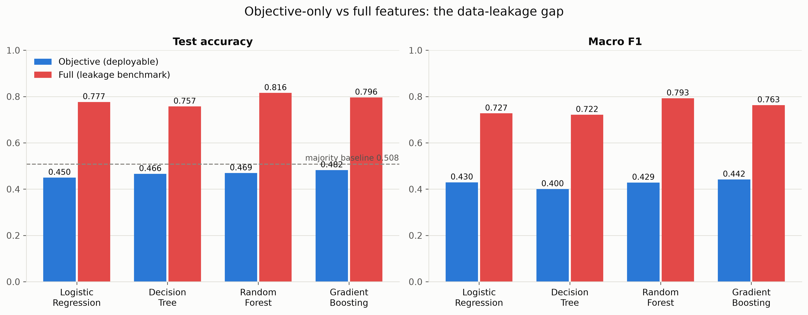
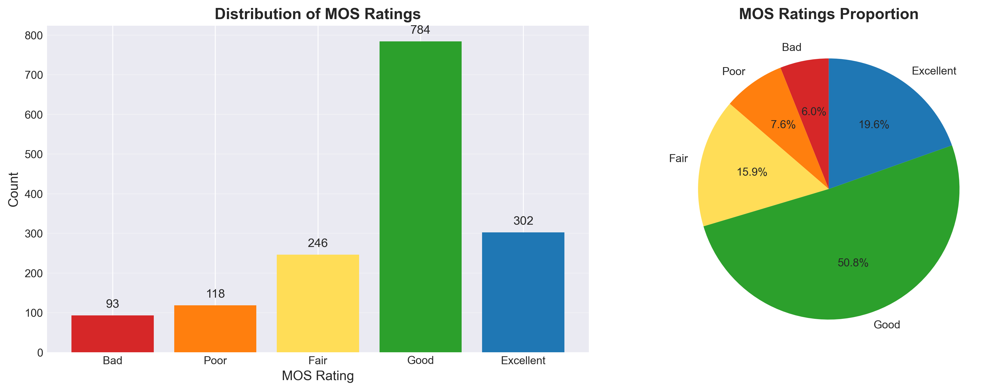

# Poqemon QoE: Honest Prediction of Mobile Video Streaming Quality

Machine learning on 1,543 real mobile video streaming sessions to predict user satisfaction (MOS 1-5) from objective technical metrics — with a controlled experiment that quantifies exactly how much accuracy inflation data leakage causes on this dataset.

[](https://www.python.org/downloads/)
[](https://scikit-learn.org/)


## Headline Results

> **With objective technical metrics only, the best model (Gradient Boosting) reaches 48.2% test accuracy, macro F1 0.442, Cohen's kappa 0.261 — versus the majority baseline's 50.8% accuracy, 0.135 macro F1, 0.000 kappa.**
> **Adding the dataset's subjective user-feedback features inflates the best model to 81.6% accuracy (macro F1 0.793): a quantified 33.3-point data-leakage gap.**
> **The 81.6% figure is the contaminated benchmark, not a deployable result — the honest number is 48.2%.**

The honest headline sits *below* the majority baseline on raw accuracy, and that is not a typo: with genuinely balanced class weights the models stop defaulting to the majority class ("Good", 50.8% of samples), trading raw accuracy for minority-class detection — Bad-session recall rises to 84.2%, and the chance-corrected metrics clearly beat the baseline (kappa 0.261 vs 0.000, macro F1 0.442 vs 0.135). A majority-class predictor scores 50.8% accuracy while detecting nothing.

The leakage audit is the core contribution. The QoF_* features are ratings the user gave during the session (QoF_audio correlates r=0.841 with MOS) — information a deployed system never has. Training identical models with and without them turns "this benchmark looks too good" into a measured 33.3-point inflation, replicated across all four model families (+29.1 to +34.6 points).



### Model Comparison

All numbers from [`results/metrics/model_comparison.csv`](results/metrics/model_comparison.csv), regenerated end-to-end by [`scripts/run_leakage_experiment.py`](scripts/run_leakage_experiment.py) — test set n=309, stratified 80/20 split, seed 42.

| Model | Features | Test Accuracy | F1 (macro) | Kappa | Train-Test Gap |
| ------- | ---------- | --------------- | ----------- | ------- | ---------------- |
| Baseline (majority class) | — | 50.8% | 0.135 | 0.000 | 0.0 |
| Logistic Regression | Objective | 45.0% | 0.430 | 0.234 | 2.4 |
| Decision Tree | Objective | 46.6% | 0.400 | 0.197 | 53.4 |
| Random Forest | Objective | 46.9% | 0.429 | 0.241 | 51.5 |
| **Gradient Boosting** | **Objective** | **48.2%** | **0.442** | **0.261** | 33.1 |
| Logistic Regression | Full (leakage) | 77.7% | 0.727 | 0.679 | 0.1 |
| Decision Tree | Full (leakage) | 75.7% | 0.722 | 0.638 | 24.3 |
| **Random Forest** | **Full (leakage)** | **81.6%** | **0.793** | **0.735** | 15.2 |
| Gradient Boosting | Full (leakage) | 79.6% | 0.763 | 0.705 | 13.7 |

*On the large train-test gaps: the trees run at scikit-learn library defaults (no depth limits, no hyperparameter search — a documented scope decision), so they memorize the 1,234 training samples (Decision Tree 100% train accuracy, Random Forest 98.5%). Model ranking uses test metrics only and is unaffected; read 48.2% as the floor of an untuned model, not the ceiling of the approach.*

## Quick Start

The full dataset is committed in this repo (`data/raw/pokemon.csv`, 1,543 sessions), so everything runs from a fresh clone.

```bash
git clone https://github.com/CY-HYUN/Poqemon-QoE-Dataset-master.git
cd Poqemon-QoE-Dataset-master

python -m venv .venv
.venv\Scripts\activate        # Windows
# source .venv/bin/activate   # macOS/Linux

pip install -r requirements.txt
python scripts/run_leakage_experiment.py   # reproduces every model number and figure in this README
```

The script is self-contained (raw CSV in → metrics CSV + figures out) and is the canonical source for all reported model numbers. The notebooks hold the exploratory analysis behind it:

| Order | Notebook | What it does |
| ------- | ---------- | -------------- |
| 1 | `notebooks/01_data_understanding.ipynb` | Validates the CSV, target distribution |
| 2 | `notebooks/02_exploratory_data_analysis.ipynb` | Correlations, network ANOVA, buffering threshold |
| 3 | `notebooks/03_data_preprocessing.ipynb` | Feature engineering; **writes `data/processed/*.csv`** (the script applies the same steps in-memory) |
| 4 | `notebooks/04_modeling_and_evaluation.ipynb` | Earlier modeling exploration (no class weights, hand-set hyperparameters); **superseded by the script** for reported numbers |

Data note: the original Poqemon documentation cites 1,560 sessions; the distributed CSV contains 1,543. The discrepancy is verified and documented in notebook 01.

## How It Works

Four-stage pipeline on the PoQeMoN crowdsourcing dataset (LiSSi lab, Paris Est Creteil University: 181 testers, 4 French mobile operators, 9 Android devices):

1. **Data understanding** — 1,543 sessions, 23 features in 5 categories (application, network, device, user, feedback), zero missing values, severe imbalance (MOS=4 is 50.8% of samples).
2. **EDA** — buffering time is the strongest objective signal (r=-0.482); network type matters (ANOVA F=37.47, p<0.001, EDGE mean MOS 1.56 vs HSPA+ 3.84); QoF_* feedback features correlate up to r=0.841 with the target, flagging them as leakage.
3. **Preprocessing** — drop identifiers and high-cardinality device columns, one-hot encode the operator, engineer 4 features (buffering severity, network generation, video/audio quality composites), build **two feature variants**: objective-only (drops the four QoF_* feedback ratings plus two near-constant columns — QoU_Ustedy, 92.4% identical, and QoA_VLCresolution, 95.6% at 360p — leaving 19 features) and full (all 25, the leakage benchmark). Stratified split, scaler fitted on train only.
4. **Modeling** — baseline + 4 classifiers with balanced class weighting: `class_weight='balanced'` for Logistic Regression / Decision Tree / Random Forest; Gradient Boosting has no `class_weight` parameter, so it is fitted with balanced sample weights (`compute_sample_weight('balanced')`). All other hyperparameters are scikit-learn defaults. Evaluated on accuracy, macro F1, Cohen's kappa, and train-test gap; each model trained on both variants to measure the leakage gap.

## Dataset at a Glance

PoQeMoN crowdsourcing campaign (2015): 181 testers watched video over live French mobile networks while VLC-side metrics were logged and users rated each session.

| MOS | Label | Count | Share |
| ----- | ------- | ------- | ------- |
| 1 | Bad | 93 | 6.0% |
| 2 | Poor | 118 | 7.6% |
| 3 | Fair | 246 | 15.9% |
| 4 | Good | 784 | **50.8%** (majority class = baseline) |
| 5 | Excellent | 302 | 19.6% |



The imbalance drives the design choices: stratified splitting, balanced class weights, and macro F1 / Cohen's kappa instead of accuracy alone.

Network technology alone separates the extremes (one-way ANOVA F=37.47, p<0.001):

| Network | EDGE (2G) | UMTS (3G) | HSPA | HSPA+ | LTE (4G) |
| --------- | ----------- | ----------- | ------ | ------- | ---------- |
| Mean MOS | 1.56 | 3.64 | 3.26 | 3.84 | 3.78 |

## Key Findings

1. **Data leakage, quantified: 33.3 points.** Best objective model 48.2% vs best full model 81.6% test accuracy (macro F1 0.442 vs 0.793). The gap replicates across all four model families (+29.1 to +34.6 points), so any result on this dataset that includes QoF_* features is measuring "predict the user's rating from the user's other ratings."
2. **Balanced class weights move the errors, they don't raise the ceiling.** Honest accuracy lands below the majority baseline (48.2% vs 50.8%) because the models stop defaulting to "Good"; in exchange, Bad-session recall reaches 84.2% and kappa/macro F1 clearly beat the baseline. Under 50.8% imbalance, accuracy alone is the wrong yardstick.
3. **Buffering is the dominant QoE driver** — the three buffering features hold 33.8% of the objective Random Forest's feature importance (time 17.8% + severity 13.0% + count 3.1%), and sessions with 3+ buffering events drop from MOS >= 3.6 to below 2.4.
4. **The model family barely matters on objective features** — test accuracy spans only 45.0-48.2% and macro F1 0.400-0.442 across four different classifiers. The objective feature set, not the classifier, is the binding constraint.
5. **Good vs Excellent lives in subjective perception** — objective MOS=5 recall is 43.3% (25 of 60 Excellent sessions predicted as Good); with the leaky QoF features it jumps to 93.3%.
6. **Counterintuitive:** bitrate (r=0.090) and resolution (r=-0.022) barely correlate with satisfaction — adaptive streaming likely trades resolution against buffering.

### Where the Objective Model Fails (per-class recall, Gradient Boosting objective)

| Actual MOS | 1 (Bad) | 2 (Poor) | 3 (Fair) | 4 (Good) | 5 (Excellent) |
| ------------ | --------- | ---------- | ---------- | ---------- | ---------------- |
| Recall | **84.2%** | **16.7%** | 38.8% | 53.5% | 43.3% |

With balanced class weights the failure mode is adjacent-class confusion in the crowded middle, not majority-class collapse: Poor is the weakest class (4 of 24 caught), and the Good/Excellent boundary blurs in both directions — 44 of 157 true Good sessions are predicted Excellent, 25 of 60 true Excellent sessions are predicted Good. With the leaky QoF features included, Excellent recall jumps to 93.3% and Poor to 62.5%, confirming that the missing signal is subjective perception, not technical metrics. Full confusion matrices in [docs/DETAILS.md](docs/DETAILS.md).

## What 48.2% Is (and Isn't) Good For

Suitable: trend monitoring, A/B comparison of network configurations, early-warning flags for human review (it catches 84% of Bad sessions). Not suitable: automated SLA enforcement or any decision where a ~52% raw error rate is unacceptable. Dataset caveats: 2015, Paris-region, Android-only, mostly 360p video. Full assessment in [docs/DETAILS.md](docs/DETAILS.md).

## Project Structure

```text
Poqemon-QoE-Dataset-master/
├── data/
│   ├── raw/                  # Full dataset, committed (pokemon.csv/.arff/.data/.names)
│   └── processed/            # Train/test splits — generated by notebook 03
├── scripts/
│   └── run_leakage_experiment.py  # ⭐ Canonical experiment: raw CSV → metrics CSV + figures
├── notebooks/                # 01-04 analysis notebooks + ANALYSIS_*.md writeups
├── results/
│   ├── figures/              # Committed visualizations (EDA, confusion matrices, comparison)
│   └── metrics/model_comparison.csv
├── docs/
│   ├── DETAILS.md            # Full methodology, per-class results, critical assessment
│   ├── DATASET_DESCRIPTION.md
│   └── SETUP_GUIDE.md
├── reports/FINAL_PROJECT_REPORT.md
├── src/                      # Shared helpers (data loading, model utils, plotting)
├── config/config.py
└── requirements.txt
```

## Tech Stack

Python 3.12+ (numbers verified with scikit-learn 1.9.0, pandas 3.0.3, numpy 2.5.1), pandas, numpy, scipy, scikit-learn, matplotlib, seaborn, Jupyter.

## More Detail

- [docs/DETAILS.md](docs/DETAILS.md) — full methodology, feature catalog, per-class confusion analysis, limitations, references
- [notebooks/ANALYSIS_01-04](notebooks/) — stage-by-stage findings written up per notebook
- [reports/FINAL_PROJECT_REPORT.md](reports/FINAL_PROJECT_REPORT.md) — long-form report (historical; its model numbers predate the script and are superseded)

## Acknowledgments

Dataset: PoQeMoN project, LiSSi laboratory, Paris Est Creteil University (UPEC), France (Amour et al., MSWiM '15). Academic use.

**Author**: Changyong Hyun
